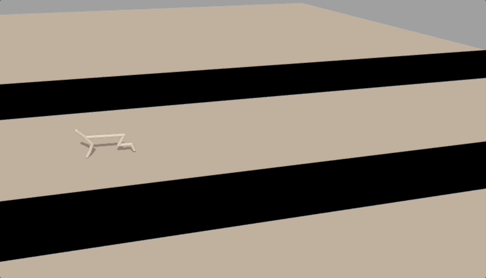

# When Does Neuroevolution Outcompete Reinforcement Learning in Transfer Learning Tasks?


This is the code that accompanies [our paper at GECCO 2025](https://dl.acm.org/doi/10.1145/3712256.3726475).

<div style="display: flex; gap: 20px; justify-content: center;">
  <div style="text-align: center;">
    
  </div>
  <div style="text-align: center;">
    
  </div>
</div>

<div style="display: flex; gap: 20px; justify-content: center; margin-top: 20px;">
  <div style="text-align: center;">
    
  </div>
  <div style="text-align: center;">
    
  </div>
</div>

<div style="display: flex; gap: 20px; justify-content: center; margin-top: 10px;">
  <div style="text-align: center; width: 200px;">
    <p><em>Stepping Gates Benchmark</em></p>
  </div>
  <div style="text-align: center; width: 200px;">
    <p><em>EcoRobot Benchmark</em></p>
  </div>
</div>


## Installing dependencies

We provide the library dependenices in the file [requirements.txt](requirements.txt).
You can create a virtual environment and install them using [uv](https://docs.astral.sh/uv/) with the following commands:

```
uv venv .
uv pip install -r requirements.txt
```

The package manager often installs different versions from the ones in the file, so you may need to make sure that you have the right verion manually. It is important to have the right versions for Brax- and jax-related libraries.


Our study considered two benchmarks: [ecorobot](https://github.com/eleninisioti/ecorobot) and [stepping gates](https://github.com/eleninisioti/stepping_gates). These are standalone github repos.
If you want to rerun training you will need to clone them under directory [envs](envs) using the following commands:


```
cd envs
git clone https://github.com/eleninisioti/ecorobot
git clone https://github.com/eleninisioti/stepping_gates
```


## Code overview
This repo contains the following directories:
* [methods](methods) contains the implementation of the methods we have benchmarked. (While we have employed existing libraries we have made internal changes to support curriculum learning and logging):
  * [brax](methods/RL) contains the implementation of PPO and goal-conditioned PPO (extending [Brax](https://github.com/google/brax/tree/main/brax))
  * [tensorneat](methods/tensorneat) contains the implementation of NEAT and HyperNEAT (extending [tensorneat](https://github.com/EMI-Group/tensorneat))
  * [neuroevolution](methods/neuroevolution) contains the implementation of CMA-ES (this is a general framework for training direct encodings using [evosax](https://github.com/RobertTLange/evosax))

* [scripts](scripts) contains:
  * [train](scripts/train) scripts for rerunning traning. For each method we provide code for training in all tasks described in the paper, with the hyperparameters provided in a separate file 


## Inspecting trained methods

We have provided all data produced by running our benchmarking in a zipped folder that you can download and extract in this project from [here](https://drive.google.com/file/d/1F0sjuthZQ8QqfyXVm49XKQHzH1_9WMsI/view?usp=sharing).

Alternatively, you can rerun training by calling the appropriate script from [scripts/train](scripts/train)(we have run our simuulations on an NVIDIA RTX 6000 GPU. To provide an approximate estimate, a trial in stepping gates requires about 10 minutes of training and a trial in ecorobot about 30 minutes, with this of course differing across methods).

Experiments are saved under directory [projects](projects). An experiment contains the trained policies and information about evaluation.


If you would like to cite our study, please use:
```

@inproceedings{10.1145/3712256.3726475,
author = {Nisioti, Eleni and Plantec, Erwan and Montero, Milton and Pedersen, Joachim and Risi, Sebastian},
title = {When Does Neuroevolution Outcompete Reinforcement Learning in Transfer Learning Tasks?},
year = {2025},
isbn = {9798400714658},
publisher = {Association for Computing Machinery},
address = {New York, NY, USA},
url = {https://doi.org/10.1145/3712256.3726475},
doi = {10.1145/3712256.3726475},
booktitle = {Proceedings of the Genetic and Evolutionary Computation Conference},
pages = {48–57},
numpages = {10},
keywords = {neuroevolution, benchmarking, reinforcement learning, evolution strategies, indirect encodings},
location = {NH Malaga Hotel, Malaga, Spain},
series = {GECCO '25}
}
````
